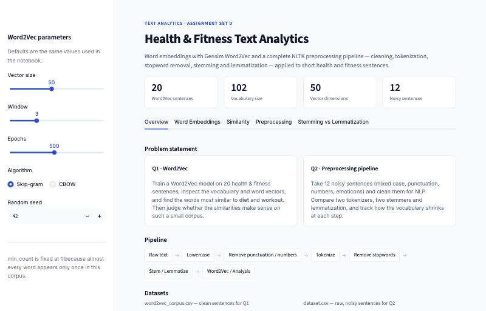

# Health & Fitness Text Analytics

**Word2Vec embeddings and a full text preprocessing pipeline, built on short health & fitness sentences.**


**Live app:** _link goes here after deployment_ &nbsp;·&nbsp; **Report:** [Project_Report.pdf](docs/Project_Report.pdf) &nbsp;·&nbsp; **Notebook:** [TextAnalytics_SetD.ipynb](TextAnalytics_SetD.ipynb)



---

## Problem statement

Computers can't read raw text. It has to be **cleaned**, **split into words**, **reduced** to the useful words, and finally **turned into numbers**. This project covers both halves of that process.

| | Task | Goal |
|---|---|---|
| **Q1** | Word2Vec | Train a Gensim Word2Vec model on 20 sentences, inspect the vocabulary and vectors, find the words most similar to **diet** and **workout**, and judge whether the results make sense. |
| **Q2** | Preprocessing pipeline | Clean 12 noisy sentences, compare `word_tokenize` with `RegexpTokenizer`, remove stopwords, compare Porter and Snowball stemming with WordNet lemmatization, and track the vocabulary size at each step. |

## Datasets

| File | Rows | Used in | Description |
|---|---|---|---|
| [`data/word2vec_corpus.csv`](data/word2vec_corpus.csv) | 20 | Q1 | Clean sentences about diet, workouts, sleep and recovery. *diet* appears 8 times, *workout* 6 times. |
| [`data/dataset.csv`](data/dataset.csv) | 12 | Q2 | The same topic but noisy: `DIET`, `!!`, `...`, `7-8 hrs`, `&`, `:)` |

Both files have a single column, `text`.

## Pipeline

```
raw text → lowercase → remove punctuation / numbers / symbols → collapse spaces
        → tokenize → remove stopwords → stem / lemmatize → Word2Vec / analysis
```

The cleaning function used in Q2:

```python
def clean_text(text):
    text = text.lower()                        # DIET -> diet
    text = re.sub(r"[^a-z\s]", " ", text)      # punctuation, digits, symbols -> space
    text = re.sub(r"\s+", " ", text).strip()   # collapse extra spaces
    return text
```

## Results

### Q1: Word2Vec

`Word2Vec(vector_size=50, window=3, min_count=1, sg=1, epochs=500, seed=42, workers=1)`, trained on stopword-free tokens.

| | |
|---|---|
| Sentences | 20 |
| Vocabulary | 102 words |
| Vector shape | (50,) |

| Rank | Similar to *diet* | Score | Similar to *workout* | Score |
|---|---|---|---|---|
| 1 | digestive | 0.917 | consistent | 0.931 |
| 2 | balanced | 0.910 | stretching | 0.925 |
| 3 | sudden | 0.908 | levels | 0.918 |
| 4 | cause | 0.907 | injury | 0.916 |
| 5 | change | 0.907 | reduces | 0.915 |

**Takeaway:** *balanced* is a real relationship ("balanced diet" appears 3 times). The other neighbours just shared a single sentence with the target word. With only 20 sentences, Word2Vec learns which words appeared together, not what they mean.

### Q2: Preprocessing

| Stage | Vocabulary size |
|---|---|
| Raw tokens | 77 |
| After stopword removal | 63 |
| After Porter stemming | 62 |
| After Snowball stemming | 62 |
| After lemmatization | 62 |

Total tokens went from 95 to 74 after stopword removal.

Porter and Snowball disagree on two words in the dataset:

| Word | Porter | Snowball | Lemma |
|---|---|---|---|
| quickly | quickli | quick | quickly |
| hrs | hr | hrs | hrs |

**Takeaway:** stemming is fast but produces non-words (`balanc`, `calori`, `densiti`). Lemmatization with POS tags returns real words (`improve`, `build`, `burn`). I'd use stemming for search and lemmatization for classification or anything people read.

## Web app

`app.py` runs the same code as the notebook in an interactive dashboard.

- **Overview**: problem statement, pipeline and both datasets
- **Word Embeddings**: every word plotted in 2D with PCA; pick a word to highlight its top-5 neighbours
- **Similarity**: top-5 bar charts, the raw vector as a heatmap, and vector arithmetic
- **Preprocessing**: type any sentence and watch it go through every step
- **Stemming vs Lemmatization**: Porter, Snowball and lemma for every word, with disagreements highlighted

Sliders in the sidebar (vector size, window, epochs, algorithm, seed) retrain the model live, so you can see what each parameter actually does.

## Project structure

```
ml_bba/
├── TextAnalytics_SetD.ipynb     notebook: Q1 + Q2 with all outputs
├── app.py                       Streamlit dashboard
├── data/
│   ├── word2vec_corpus.csv      Q1 corpus
│   └── dataset.csv              Q2 raw dataset
├── docs/
│   ├── Project_Report.pdf       full explanation of the project
│   ├── Project_Explanation.docx submission write-up
│   └── screenshots/
├── requirements.txt
└── .streamlit/config.toml       app theme
```

## Run locally

```bash
git clone https://github.com/SayAn1-dls/ml_bba.git
cd ml_bba
pip install -r requirements.txt
streamlit run app.py
```

To run the notebook, `pip install jupyter` and open `TextAnalytics_SetD.ipynb`. NLTK data (stopwords, WordNet, tokenizer, POS tagger) downloads automatically the first time.

## Tech stack

Python 3.12 · NLTK · Gensim · pandas · scikit-learn (PCA) · Plotly · Streamlit
